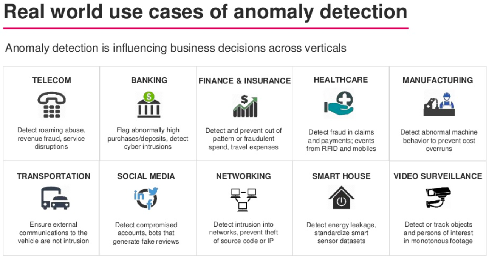
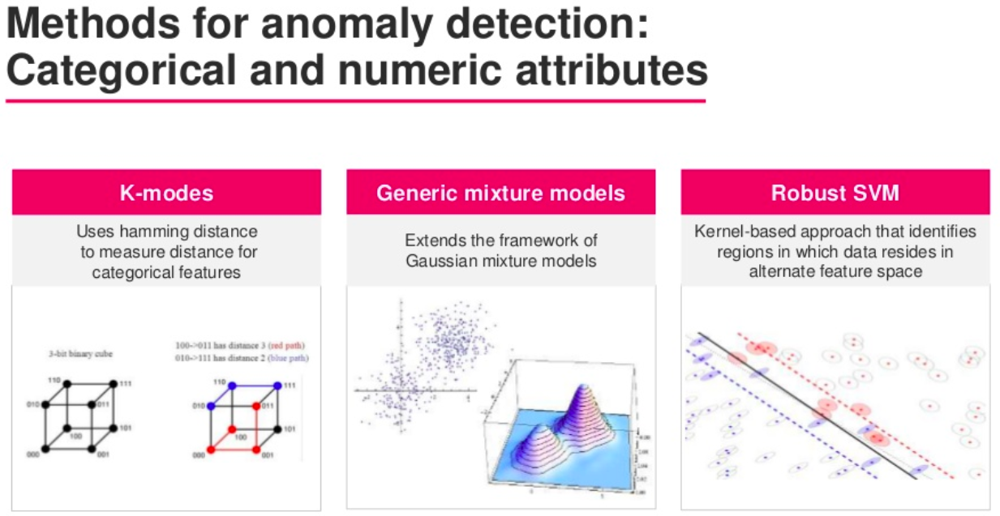
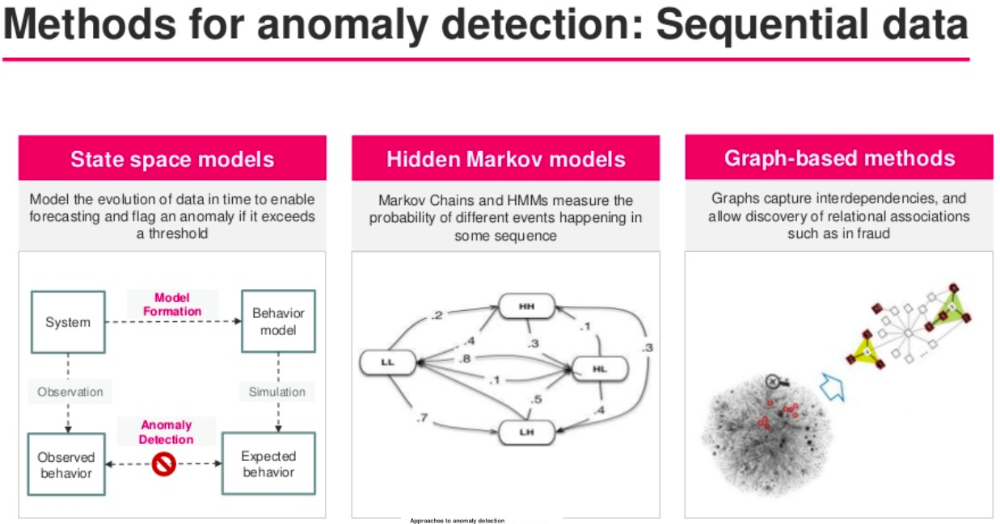
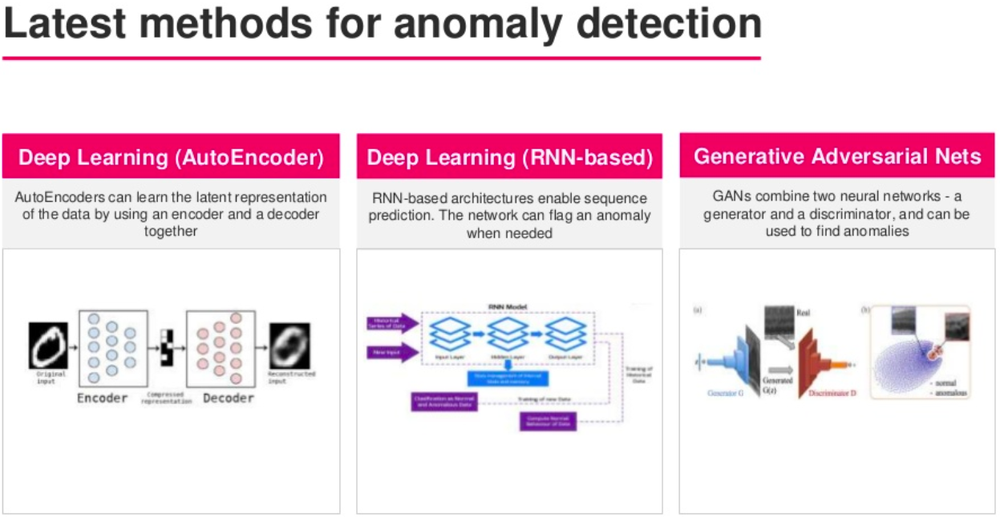
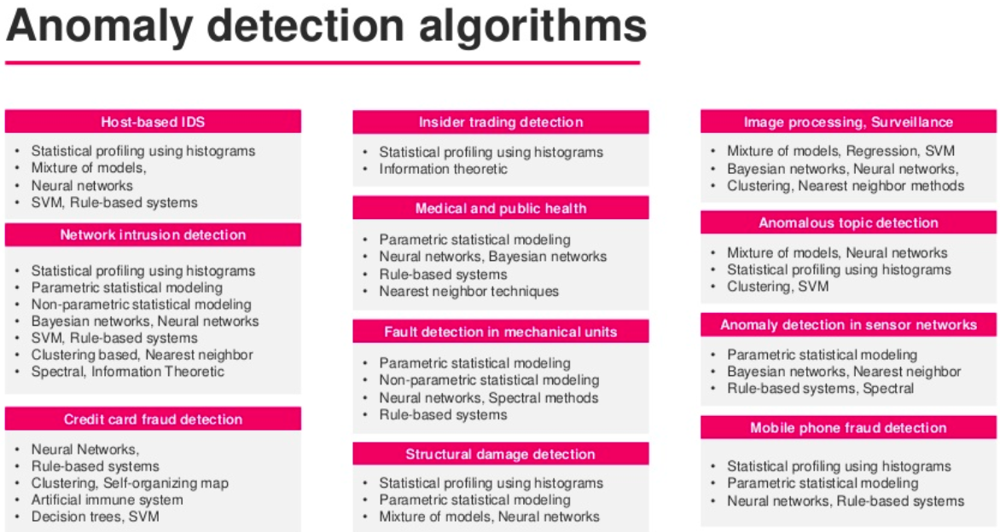

- Daily note taking moved from [Notes on SE Searches](https://docs.google.com/document/d/1Tzk-rt9Iq5PMFyI0D2QSWkeJNdG9DP7W8cS0-wgFEUQ/edit?usp=sharing) and [Meeting Notes](https://docs.google.com/document/d/1OFizaxvUc4ylY0MqwCrYtmZQpb42OmZh0jL8bH1VjUE/edit?usp=sharing) in Google Drive to this calandar.
- Decisions made :
    - Stopped watching lectures since it doesn't contribute to narrow down thes search for goal making process
    - Selecting a specific senario is important. since nature of data dictates techquniqes used
    - Found this [slide set](https://www.slideshare.net/streamanalytix/anomaly-detection-real-world-scenarios-approaches-and-live-implementation)
    
    
    
    
     
    - Fields to select from 
        - Banking - too much competition
        - Finance - lot of statistical techquniques
        - Socila Media - Intresting data set

- Skimmed [Anomaly detection on time series](xplore.ieee.org/xpls/abs_all.jsp?arnumber=5687485) to get more direction.
    - Problem setting for time series anomaly detection
        - Detecting contextual anomilies
        - Detecting anomalous subsequencewith respect to a given long sequence (time series)
        - If the anomalous subsequence is of unit length, this problem is equivalent to finding
contextual anomalies in the time series
    - Chalenges
        - exact length of sumsequence is not known
    - Types of time series data
        - Periodic - Synchronous(multiple values are synchronised eg: temprature & pressue messurements are in sync) time series
        - Aperiodic - Synchronous
        - Periodic - Asynchronous
        - Aperiodic - Asynchronous
    - AD techniques can be classified by process(Procedural dimension) and the way data transformed prior to AD (Transformation dimension)

    - New leads:
        - To be clarified by on next work session
    