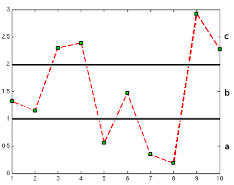

### Skimmed [Anomaly detection on time series](xplore.ieee.org/xpls/abs_all.jsp?arnumber=5687485) to get more direction(Continued).
- Technque by data transformation(pre-processing)
    - other notes
        - Many anomaly detection algorithms expect multiple time series to be at a compa-
rable scale. Thus one needs to normalize the data so that each attribute contributes uniformly for the similarity.
    - Aggregation
        - compress a time series by replacing a set of consecutive values by a representative value of them (usually their average)
        - masks noise and missing values
        - mask some critical features of the data that may make it harder to detect anomalies.
        - Piecewise Aggregate Approximation (PAA)
        - Adaptive piecewise constant approximation(APCA)
            - variable length frames
            - motivation behind this approach is that there can be a single segment in the area of low variance and multiple segments in the areas of high variance
        - value in the output time series can correspond to varying number of events in the original time series or just one instance value

    - Discretization
        - convert the given time series into a discrete sequence of finite alphabets
        
        - Primary motivation behind discretization is to utilize the existing symbolic sequence anomaly detection algorithms
        - cause loss of information. Discretization
        - Equal bin size
            - amplitude range can be divided into n equal bins
        - Equal frequency
            - bin has equal number of data points
        - Clustering
            - each bin has closely related values and thus a unique discrete symbol can be assigned to each bin
        - SAX (Symbolic Ag- gregate approXimation)
    - Signal Processing 
        - transform signals to different space
        - Fourier transforms
        - wavelet transforms
        - help to obtain this entirely different space of coefficients where the data can be analyzed
- Technique by process
    - Window Based Similarity
    - Similarity Based
    - Prediction Based
    - HMM Based
    - Segmentation

### Intrest Shifts
- Intrest has shifted to 
    - Times serires anolamy detection(dynamic data set)
    - Dynamic graph based anomaly detection

### Other notes
- Nerual network based anomaly detection tequniques fits new data to old data to calculate a sucpisouion score for anomaly
- Neural nets approcimate a function 
## To Do
- Explore Dynamic Graph anomaly detection methods
