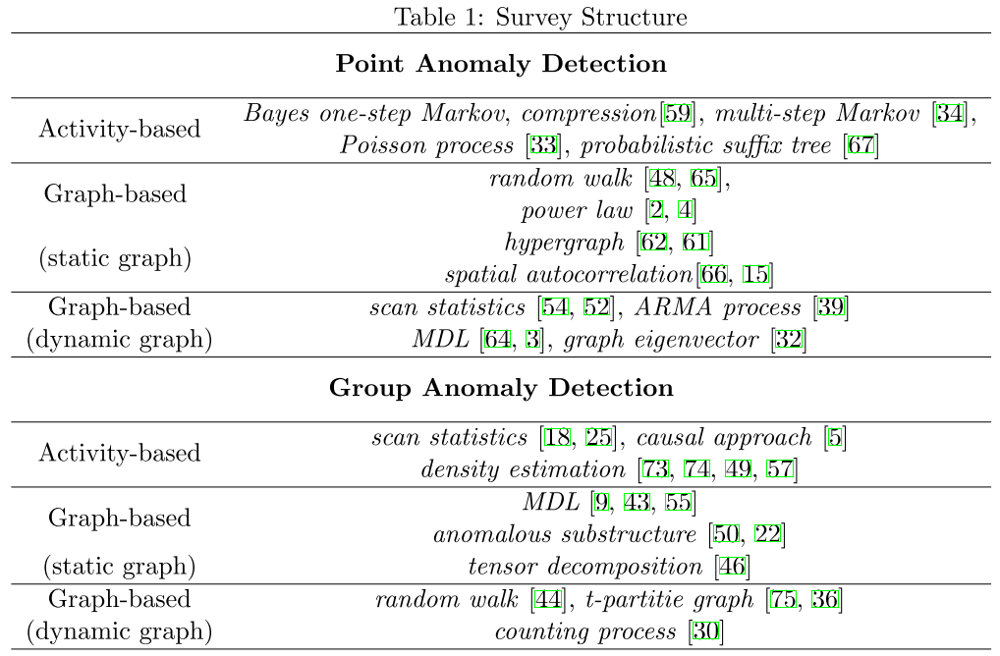

### Skimmed [A Survey on Social Media Anomaly Detection](http://arxiv.org/abs/1601.01102) because of the interest in the field

- 
- Group anomaly is usually more subtle than individual anomaly. At the individual level, the activities might appear to be normal
- As in most cases, it is very difficult to obtain the ground truth labels for the anomalies.
- many of the existing methods deal with memory-resident graphs, while real life social networks are often too large to fit into the memory.

#### Pont Anomaly Detection
- Activity based
- Graph based
    - good for relational data
    - Static Graphs
        - a 
#### Group Anomaly Detection

### Notes
- Go to details on the topic once we pick senario

### To Dos
- Explore Dynamic Graph based anomaly detection techniques.
- Explore Times Series anomlay detetion techniques invloved with Nural nets

- Armia & Arimax
    - Thrshold how does it keeps the thrshold
    - Can we Improve by injecting a normal patern

- Consider About the data set
    - Robasta data
    - Keggle